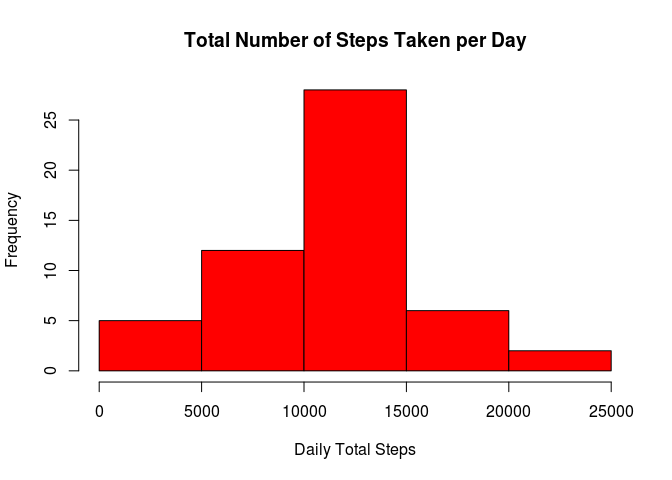
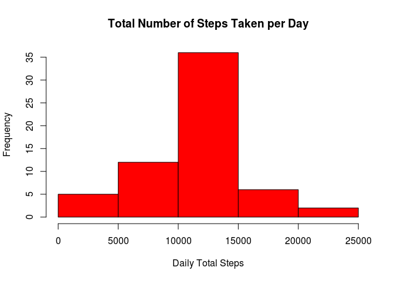

# Reproducible Research: Peer Assessment 1


## Loading and preprocessing the data
To read file with data we need unzip the archive and then read data with 'read.csv()'. After reading we will convert the string 'date' variable into Date type:

```r
## Set the working directory
setwd("~/Desktop/coursera/05_ReproducibleResearch/RepData_PeerAssessment1")

## Clean the working environment
rm(list = ls())
graphics.off()

## Unzip the archive and read data 
zipfile <- "activity.zip"
file <- "activity.csv"

if(!file.exists(file)) unzip(zipfile)

data <- read.csv("activity.csv", header = TRUE, stringsAsFactors = FALSE)
data$date <- as.Date(data$date)
```


## What is mean total number of steps taken per day?
In this section we will summarize the total number of steps taken per each day and create new data frame 'totalsteps' with summary values. We will use the 'aggregate()' function. Then we will make a histogram of the total number of steps taken each day and calculate the **mean** and **median** total number of steps taken per day.

```r
totalsteps <- aggregate(steps ~ date, data = data, sum, na.rm = TRUE)

hist(totalsteps$steps, col = "red", main = "Total Number of Steps Taken per Day", xlab = "Daily Total Steps")
```

 

```r
totalmean <- mean(totalsteps$steps, na.rm = TRUE)
totalmedian <- median(totalsteps$steps, na.rm = TRUE)
```
The **mean** of the total number of steps taken per day is 1.0766189\times 10^{4}. The **median** of the total number of steps taken per day is 10765.


## What is the average daily activity pattern?
To make a time series plot of the 5-minute interval (x-axis) and the average number of steps taken, averaged across all days (y-axis), we will calculate the mean values of steps by each interval across all days.

```r
avbyinterval <- aggregate(steps ~ interval, data = data, mean)

plot(avbyinterval$interval,avbyinterval$steps, type = "l", main = "Average Number of Steps Taken per 5-minute Interval", xlab = "5-minute Intervals", ylab = "Average Number of Steps")
```

 

To find the 5-minute interval, on average across all the days in the dataset, contains the maximum number of steps we will use the 'summary()' and 'subset()' functions.

```r
summary(avbyinterval$steps, digits = 8)
```

```
##      Min.   1st Qu.    Median      Mean   3rd Qu.      Max. 
##   0.00000   2.48585  34.11321  37.38260  52.83491 206.16981
```

```r
interval <- subset(avbyinterval, steps > 206)
```
The interval is 835.


## Imputing missing values
To calculate the total number of missing values in the dataset (i.e. the total number of rows with `NA` values), not only in the 'steps' variable, we will use the next code for the 'steps' variable:

```r
missingvalues <- sum(is.na(data$steps))
```
or next code for all rows with `NA` values:

```r
goodrows <- complete.cases(data)
table(goodrows)
```

```
## goodrows
## FALSE  TRUE 
##  2304 15264
```

We can see that the number of missing values is 2304. 

We will fill the missing values in the data set with mean values of the 5-minutes intervals, across of all days.

```r
# Create a new data set
imputeddata <- data

# Fill the missing values with mean of 5-minutes intervals
for(i in 1:nrow(imputeddata)) {
        if(is.na(imputeddata$steps[i])) {
                imputeddata$steps[i] <- avbyinterval$steps[(avbyinterval$interval == imputeddata$interval[i])]
        } 
}
```
We can check imputed data set on existing of the missing values:

```r
goodimpute <- complete.cases(imputeddata)
table(goodimpute)
```

```
## goodimpute
##  TRUE 
## 17568
```
Now we can make a histogram of the total number of steps taken each day and calculate the **mean** and **median** total number of steps taken per day with imputed data.

```r
totalstepsimputed <- aggregate(steps ~ date, data = imputeddata, sum)

hist(totalstepsimputed$steps, col = "red", main = "Total Number of Steps Taken per Day", xlab = "Daily Total Steps")
```

 

```r
totalmeanimputed <- mean(totalstepsimputed$steps, na.rm = TRUE)
totalmedianimputed <- median(totalstepsimputed$steps, na.rm = TRUE)
```
The **mean** of the total number of steps taken per day is 1.0766189\times 10^{4}. The **median** of the total number of steps taken per day is 1.0766189\times 10^{4}. We can see that the difference between **mean** and **median** values of the raw data set and imputed data set is very small.   

## Are there differences in activity patterns between weekdays and weekends?
To create a new factor variable in the dataset with two levels -- "weekday" and "weekend" indicating whether a given date is a weekday or weekend day we will use nex code:

```r
imputeddata$day <- weekdays(imputeddata$date, abbreviate = TRUE)
imputeddata$daytype <- ifelse(imputeddata$day == "Sat" | imputeddata$day == "Sun", "weekend", "weekday")
```
Then we can make a panel plot containing a time series plot of the 5-minute interval (x-axis) and the average number of steps taken, averaged across all weekday days or weekend days (y-axis) with `lattice` library.

```r
library(lattice)

avbydaytype <- aggregate(steps ~ interval + daytype, data = imputeddata, mean)
xyplot(steps ~ interval | daytype, data = avbydaytype, type = "l", layout = c(1, 2), xlab = "Interval", ylab = "Number of Steps")
```

 
